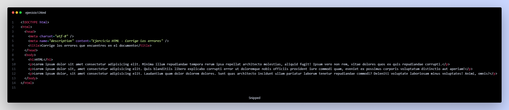

# Ejercicio 1

HTML (Lenguaje de Marcas de Hipertexto, del inglés HyperText Markup Language) es el componente más básico de la Web.

La mayoría de los elementos HTML, cuentan con etiquetas de apertura y cierre. Una etiqueta de apertura consiste en el nombre del elemento rodeado por "<" y ">"; mientras que una etiqueta de cierre consiste en el nombre del elemento rodeado por "</" y ">".

Con HTML podemos crear y estructurar secciones, párrafos y enlaces mediante elementos, etiquetas y atributos.

HTML utiliza etiquetas para distinguir entre texto, imágenes y otro contenido para mostrarlo en un navegador Web.

En este ejercicio, vamos a trabajar con la sintaxis de HTML y los elementos básicos.

Para eso, te compartiremos un archivo HTML, en el cual deberás de corregir todos los errores que encuentres en el documento.

`<DOCTYPE html>

  <html>

      <head>

          </meta charset="utf-8">

          <meta name="description" content="Ejercicio HTML - Corrige los errores">

      <body>

      </head>

      <title>Corrige los errores que encuenres en el documento</title>

      <h1>HTML</h1>

      
Lorem ipsum dolor sit amet, consectetur adipisicing elit. Molestiae quam optio nesciunt atque iure  animi dicta velit

      
Lorem ipsum dolor sit amet, consectetur adipisicing elit. Molestiae quam optio nesciunt atque iure  animi dicta velit

      </body>

      
Lorem ipsum dolor sit amet, consectetur adipisicing elit. Molestiae quam optio nesciunt atque iure  animi dicta velit

  <html>`

Solución:

